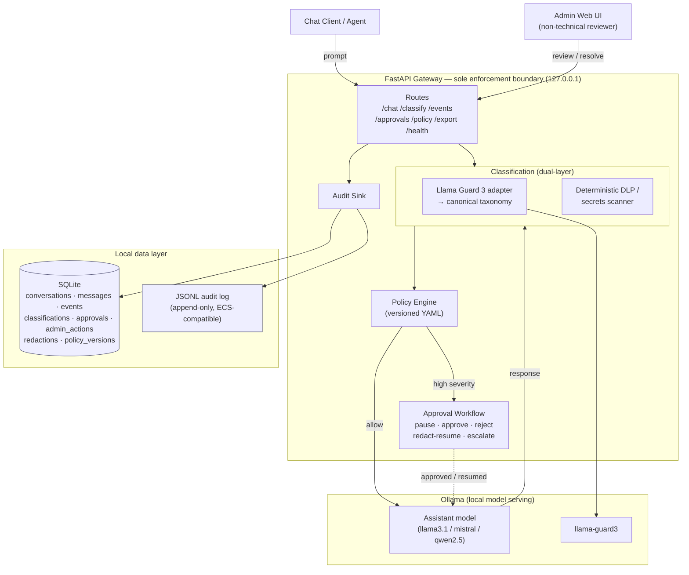

# Local AI Safety SIEM Gateway — POC

A **local-first** enforcement gateway that captures every AI prompt and response, classifies it for safety/governance risk, **pauses high-severity interactions for human approval**, and emits append-only SIEM-style audit logs for review by a non-technical safety administrator.

Everything runs on a developer workstation. No prompt, response, or classification data leaves the machine. The assistant model and the safety classifier (Llama Guard 3) are both served locally by [Ollama](https://ollama.com/).

> **Status:** Early build — Phase 1 of 4 (Gateway & Audit Foundation) in progress. See [Roadmap](#roadmap) and [`.planning/STATE.md`](.planning/STATE.md).

---

## Core idea

The **skill** ([`SKILL.md`](.claude/skills/ai-safety-siem-logger/SKILL.md)) is the *governance contract* — it tells agents to emit structured events and route risky interactions through the gateway. But a skill alone cannot enforce anything.

The **gateway** is the *enforcement boundary*. It is the **only** path to Ollama. Chat clients, agents, and the Web UI call the gateway — never Ollama directly. That is what makes capture, blocking, and approval pauses real instead of advisory.

---

## Architecture



### Request lifecycle

1. **Capture prompt** — client sends prompt to `POST /chat`; gateway records it before anything else.
2. **Classify prompt** — Llama Guard 3 (mapped to a canonical taxonomy) **plus** a deterministic DLP/secrets scanner (API keys, JWTs, private keys, cloud creds, bearer tokens, high-entropy strings, emails, phones, card-like values).
3. **Policy decision** — versioned YAML policy maps category + severity to an action. High severity → **pause** and create an approval request *before* the model runs.
4. **Generate** — on allow (or approval), the assistant model produces a response via Ollama.
5. **Classify response** — same dual-layer pass. Response is **withheld** from the user until cleared.
6. **Resolve** — admin approves, rejects, redacts-and-resumes, marks false positive, or escalates.
7. **Audit** — every decision emits an immutable event to JSONL + SQLite with correlation ID, actor, classifier result, policy version, severity, and action taken.

### Degraded modes

- **Assistant model down** → `/chat` returns a graceful operational error; the attempt is **still audited**.
- **Llama Guard down** → high-risk workflows **fail closed** rather than passing through unclassified.

---

## Event schema (audit)

Every event carries a stable, SIEM-compatible shape (see [`gateway/audit/schema.py`](gateway/audit/schema.py)):

`event_id` · `event_type` · `timestamp` · `correlation_id` · `conversation_id` · `message_id` · `actor` · `model` · `content` (sha256 + preview) · `classification` · `policy` · `approval` · `siem`

- **IDs are deterministic** (UUID5) — replaying the same turn dedupes instead of duplicating (idempotent writes). See [`gateway/audit/ids.py`](gateway/audit/ids.py).
- Content is stored as a **SHA-256 hash + 200-char preview**, not raw blobs, in the event row.
- The JSONL log is ECS-compatible for later mapping to Logstash, OpenSearch, Splunk HEC, CloudWatch, or AWS Security Lake.

---

## Project structure

```
classifier-arch-poc/
├── gateway/
│   ├── settings.py            # pydantic-settings config from .env (Ollama URL isolated here per GATE-03)
│   ├── audit/
│   │   ├── schema.py          # canonical AuditEvent + build_event() with Phase 1 defaults
│   │   ├── db.py              # SQLite (WAL, FK on, 0o600), 8-table DDL
│   │   └── ids.py             # deterministic UUID5 event/message IDs
│   ├── adapters/              # (stub) assistant / guard / scanner / policy / sink / approval
│   └── routes/                # (stub) /chat /classify /events /approvals /policy /export /health
├── tests/
├── .claude/skills/ai-safety-siem-logger/SKILL.md   # governance contract
├── .planning/                 # GSD roadmap, phases, state
├── .env.example
├── requirements.txt
└── CLAUDE.md                  # full architectural design pattern
```

---

## Setup

**Prerequisites:** Python 3.11+, [Ollama](https://ollama.com/) running locally with the assistant model and Llama Guard 3 pulled.

```bash
# Pull models (one time)
ollama pull llama3.1
ollama pull llama-guard3

# Python env
python -m venv .venv && source .venv/bin/activate
pip install -r requirements.txt

# Config
cp .env.example .env        # edit if your Ollama URL / models differ
```

### Configuration (`.env`)

| Variable | Default | Purpose |
|---|---|---|
| `OLLAMA_BASE_URL` | `http://localhost:11434` | Ollama server |
| `OLLAMA_ASSISTANT_MODEL` | `llama3.1` | Assistant model |
| `OLLAMA_GUARD_MODEL` | `llama-guard3` | Safety classifier |
| `OLLAMA_TIMEOUT_SECONDS` | `120.0` | Per-call timeout |
| `SQLITE_DB_PATH` | `./data/gateway.db` | Local state DB |
| `JSONL_AUDIT_PATH` | `./data/audit.jsonl` | Append-only audit log |
| `GATEWAY_HOST` | `127.0.0.1` | **Local-only — do not set to `0.0.0.0` in the POC** |
| `GATEWAY_PORT` | `8000` | Gateway port |

### Tests

```bash
pytest
```

> Runtime data (`data/`, `*.db`, `*.jsonl`, `.env`) is gitignored — audit logs contain raw prompts/responses and never get committed.

---

## Roadmap

| Phase | Capability | Status |
|---|---|---|
| **1. Gateway & Audit Foundation** | `/chat` through the gateway; every turn captured to JSONL + SQLite; idempotent writes; graceful unavailability | 🔨 In progress |
| **2. Local Classification** | Llama Guard 3 + DLP/secrets score every prompt and response; per-model health; fail-closed | ⬜ Planned |
| **3. Policy, Approval & Export** | Versioned YAML policy pauses high-severity turns; admin actions; raw & redacted export | ⬜ Planned |
| **4. Admin Web UI, Skill & E2E Demo** | Non-technical review dashboard + approval queue; governance skill; full demo passing | ⬜ Planned |

Full breakdown: [`.planning/ROADMAP.md`](.planning/ROADMAP.md).

**End-to-end demo target:** safe prompt allowed → high-risk prompt paused → high-risk response paused → redacted resume → false positive marked → audit exported.

---

## Security & boundaries (POC)

- Local-only: gateway, UI, SQLite, and JSONL bind to / live on the workstation.
- SQLite file is chmod `0o600`; audit logs are gitignored.
- Policy and approval logic live in **deterministic gateway code**, outside model prompts — the assistant model can never override a classifier or policy decision (prompt-injection resistance).
- **Not production-authenticated.** Before any non-local use: add authN/authZ, signed audit events, encrypted storage, retention policy, SIEM forwarding, and cloud IAM. AWS productionization notes are in [`CLAUDE.md`](CLAUDE.md) §5.

---

## License

MIT (skill component). POC — provided as-is.
